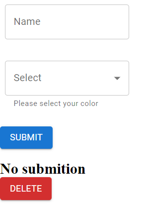
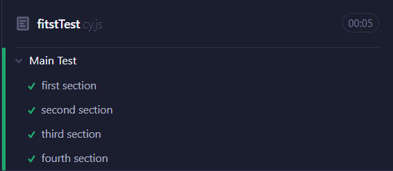

# Test Automation Cypress

Simple React Project with Cypress test automation

Components:
* Text Input
* DropDown
Also, There are two buttons that in `App.js`.

There Are four tests:
1. name is Adam, and Color is green, output is our excpect
2. name is Andrew, and Color is blue, output is our excpect
3. name is Alex, and Color is red, but output when click submit is `My name is Andrew and My favorite color is blue.`
4. My name is Alex and My favorit color is red, but output when click delete is `submition`

